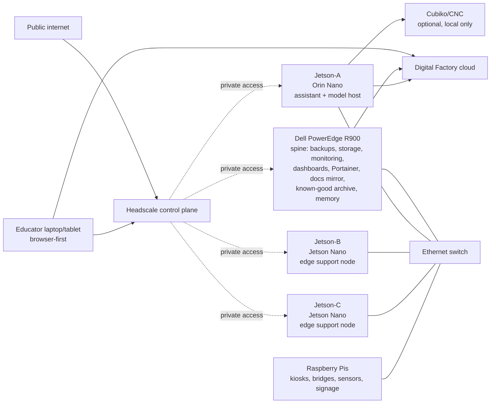

# 00 - Orientation

This repo now describes a lab with a stable spine and replaceable edge devices.

The current intended topology is:

- the **Dell PowerEdge R900** as the infrastructure spine
- **Jetson-A** as the live assistant node
- **Jetson-B and Jetson-C** as edge support nodes
- **Raspberry Pis** as disposable kiosks, displays, bridges, and sensor nodes
- an **Ethernet switch** as the room containment layer
- **Headscale** as private access control plane
- **Digital Factory** as the printer cloud source of truth
- optional **Cubiko/CNC** integration only when the machine is physically adjacent

The point is not to create a cluster.
The point is to keep the room legible, recoverable, and boring enough to survive rebuilds.

Before you change anything, read the state layers:

- `docs/CURRENT_STATE.md`
- `docs/TESTED_VALUES.md`
- `docs/KNOWN_GOOD_STATE.md`
- `docs/EXPERIMENTAL_SURFACES.md`

## Canonical names

Use one stable name per node class:

| Node | Role | Placeholder hostname |
|---|---|---|
| R900 | infrastructure spine | `r900` |
| Jetson-A | live assistant node | `jetson-a` |
| Jetson-B | edge support node | `jetson-b` |
| Jetson-C | edge support node | `jetson-c` |
| Pi nodes | disposable edge appliances | `pi-01`, `pi-02`, ... |

## What the spine owns

The R900 should carry the durable pieces:

- backups
- shared storage
- monitoring
- dashboards
- Portainer server
- Node-RED and/or MQTT if the lab actually needs them
- docs mirror or static internal site
- known-good-state archive
- internal operational memory

The R900 should not be assumed to be the primary inference box unless later documentation explicitly says so.

## What Jetson-A owns

Jetson-A is the live local assistant node:

- Open WebUI
- local model serving
- code-assistant workflows
- local docs and RAG
- browser-first educator access
- optional CNCjs if physically appropriate

## What the edge nodes own

Jetson-B and Jetson-C are support nodes:

- room status
- service polling
- local dashboards
- machine-adjacent helper roles

Raspberry Pis are smaller still:

- kiosks
- displays
- USB bridges
- signage
- sensors and cameras where useful

## Success state

The lab is in a good state when:

- the R900 can restore the room map and serve the docs mirror
- Jetson-A can answer local assistant requests without reaching for public services first
- the edge nodes can report room and machine state without depending on the assistant node
- Digital Factory remains the source of truth for printer fleet state
- private control traffic stays private
- public browser traffic stays separate
