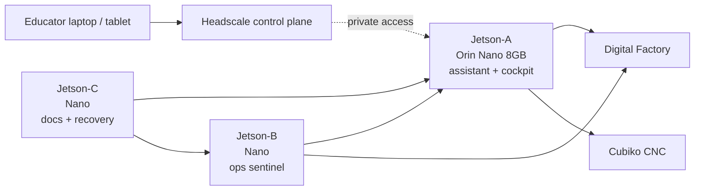

# 00 — Orientation

## What changed

The lab-brain stack now assumes **three Jetson-class machines** are available:

- one stronger Jetson-A, the Orin Nano 8GB with NVMe
- two older Jetson Nano boards

The old question was: “Can we make one always-on assistant?”

The better question is now:

> How do we make the lab legible, recoverable, and locally intelligent without creating a fragile shrine to infrastructure?

## Answer

Use the Orin as the actual model/assistant host. Use the older Nanos as support nodes.

## Names

Use these names consistently:

| Name | Role | Hostname suggestion |
|---|---|---|
| Jetson-A | main assistant/model host | `labbrain-a` |
| Jetson-B | ops sentinel | `labbrain-b` |
| Jetson-C | docs/recovery node | `labbrain-c` |
| Headscale VPS | remote access control plane | `hs.creatempls.org` |

## The important boundary

Jetson-A can be remotely reachable through the private Headscale-managed network. That does not mean it should be publicly exposed.

Do not port-forward the assistant, dashboards, CNC tools, or docs to the public internet unless there is a deliberate, reviewed reason.

## Success state

The stack is working when:

- Jetson-A can answer code/ops questions from local docs.
- Jetson-B can report whether services and machines are alive.
- Jetson-C can serve docs even if Jetson-A is being rebuilt.
- Digital Factory remains the source of truth for MakerBot/UltiMaker printer cloud state.
- Cubiko control is local and safety-adjacent, not safety-replacing.
- Educators can reach the cockpit privately when away from the room.
