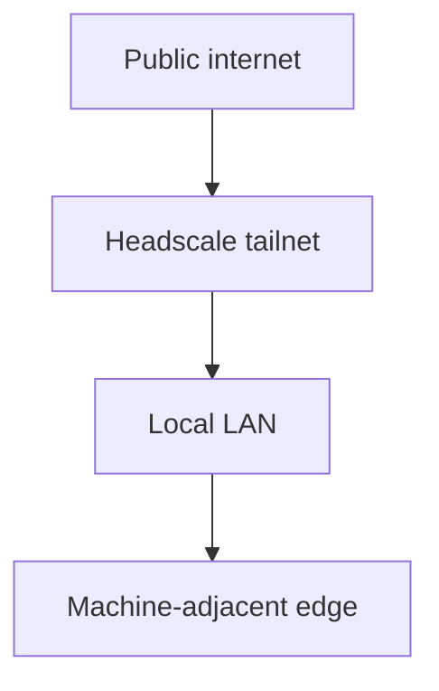

# 01 - Network Reality

The lab has four practical zones:

1. the **public internet** for cloud services and software updates
2. the **Headscale tailnet** for trusted private access
3. the **local LAN** for room devices and wired services
4. the **machine-adjacent edge** for devices that should not be treated like general servers

## Switch role

The Ethernet switch is the containment layer for the room.

Use it to keep:

- the R900 wired
- Jetson-A wired
- the Jetson Nanos wired when possible
- Pis on cable instead of Wi-Fi when the job matters
- machine bridges off the general wireless path

The switch is where boring reliability starts.

## Naming conventions

Keep names short, predictable, and role-based:

| Class | Pattern | Example |
|---|---|---|
| spine server | `r900` | `r900` |
| assistant node | `jetson-a` | `jetson-a` |
| edge support nodes | `jetson-b`, `jetson-c` | `jetson-b` |
| Pi nodes | `pi-01`, `pi-02`, ... | `pi-03` |
| optional machine bridge | `printer-*` or `cnc-*` | `printer-bridge-01` |

Do not invent alternate names for the same box.
Use `*.lab.internal` or the documented Headscale name as the canonical private layer.
Treat `.local` as a convenience layer only.

## Private versus public traffic

Private traffic:

- R900 admin surfaces
- Jetson-A assistant and local model traffic
- monitoring and dashboard access
- docs mirror access
- machine control traffic
- Headscale enrollment and node-to-node access

Public traffic:

- Digital Factory
- package registries
- GitHub and docs sources
- software updates

If a browser can reach it from hotel Wi-Fi, assume it is public.
If a browser needs Headscale or a lab cable, assume it is private.

## Headscale posture

Headscale is the control plane, not the public app.

Use it for:

- trusted device enrollment
- private service reachability
- private admin access

Do not turn it into:

- a public dashboard
- a model host
- a proxy for CNC control
- a generic office VPN unless that is separately documented and reviewed

## Optional future VLAN ideas

Future segmentation can happen, but only if the room needs it and the docs stay readable.

Possible future VLAN labels:

- spine/admin
- assistant/model
- edge devices
- machines
- guest or class tablets

Do not create VLANs as decoration.
Create them only when there is a real trust boundary or recovery reason.

## Good patterns

- browser on the LAN opening the R900 cockpit
- educator laptop using Headscale to reach Jetson-A privately
- R900 mirroring docs for recovery
- Jetson-B or Jetson-C polling room status
- Digital Factory opened directly in the browser
