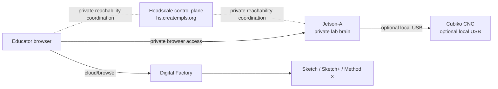
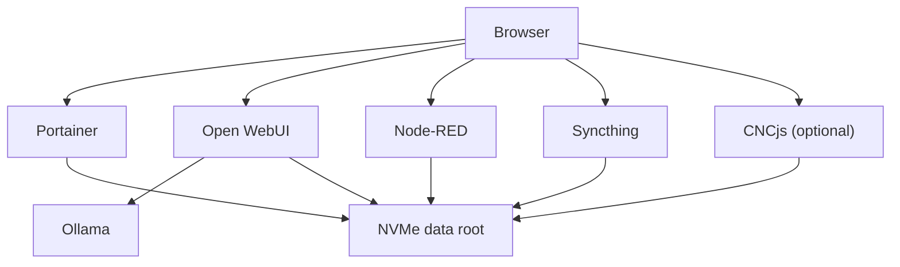

# Architecture

## Summary
The architecture is intentionally simple: one edge compute box, one private access plane, one printer cloud pane, and one optional local CNC path.

## Service picture

## Key boundary
Request traffic for private operator tools should **not** traverse the public internet as open services.
Use the Headscale-managed private path for operator access.
