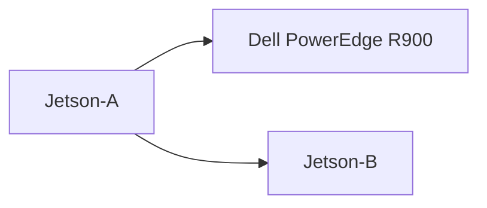

# Lab Mind Wiki

This is the working wiki for the lab.
It is written so an intern can start with almost no context and still find the next useful page.

## Start here

1. Read the orientation page.
2. Learn what belongs on the spine, the assistant node, and the edge nodes.
3. Use the handoff pages when you are standing at the machine and need a short checklist.

## Fast path for new interns

- [`docs/00_ORIENTATION.md`](docs/00_ORIENTATION.md)
- [`docs/01_NETWORK_REALITY.md`](docs/01_NETWORK_REALITY.md)
- [`docs/07_SERVICE_PLACEMENT_MATRIX.md`](docs/07_SERVICE_PLACEMENT_MATRIX.md)
- [`docs/17_DEPLOYMENT_PHASES.md`](docs/17_DEPLOYMENT_PHASES.md)
- [`docs/18_OPERATIONS_RUNBOOK.md`](docs/18_OPERATIONS_RUNBOOK.md)
- [`handoff/INTERN_ONE_PAGER.md`](handoff/INTERN_ONE_PAGER.md)
- [`handoff/OPERATOR_TOGGLE_CHECKLIST.md`](handoff/OPERATOR_TOGGLE_CHECKLIST.md)
- [`handoff/MODEL_SWITCH_CARD.md`](handoff/MODEL_SWITCH_CARD.md)
- [`handoff/MODEL_CHOICE_LADDER.md`](handoff/MODEL_CHOICE_LADDER.md)

## What this wiki is for

- documenting the real room, not a hypothetical cluster
- keeping recovery boring
- making it possible to rebuild from text
- reducing hand-holding for interns and visiting operators
- rendering diagrams with Mermaid code fences when a page needs a topology sketch

## Diagram note

When you write a diagram, use a fenced block like this:

The wiki should render that as a diagram instead of showing the raw markup.

## What to do first if something is broken

1. Check the cockpit.
2. Check the spine.
3. Check the assistant node.
4. Check the inventory templates.
5. Write down exactly what is missing.

## Notes

- placeholders are intentional
- model names are only final after they are tested
- the docs should prefer recovery over cleverness
